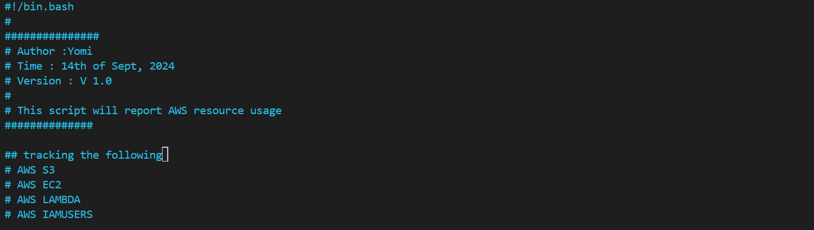
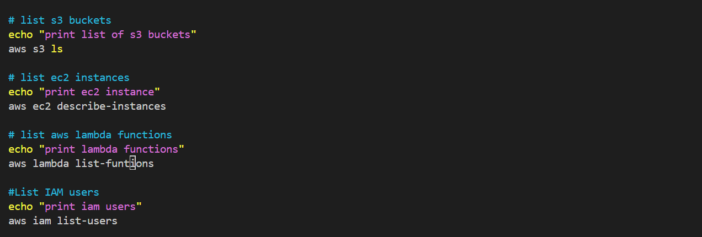
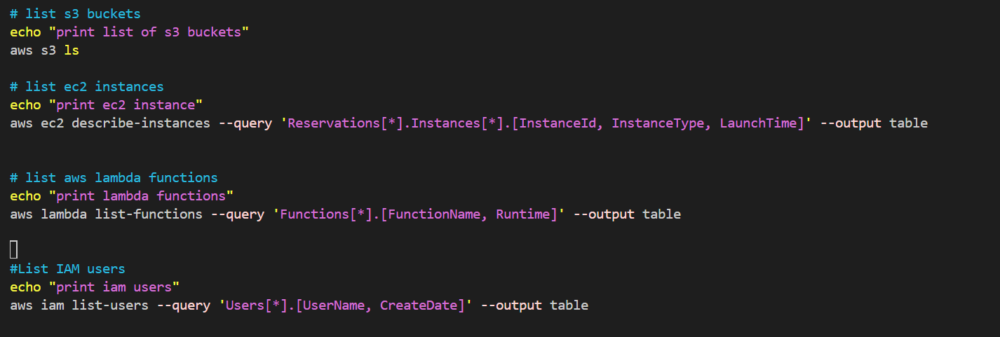
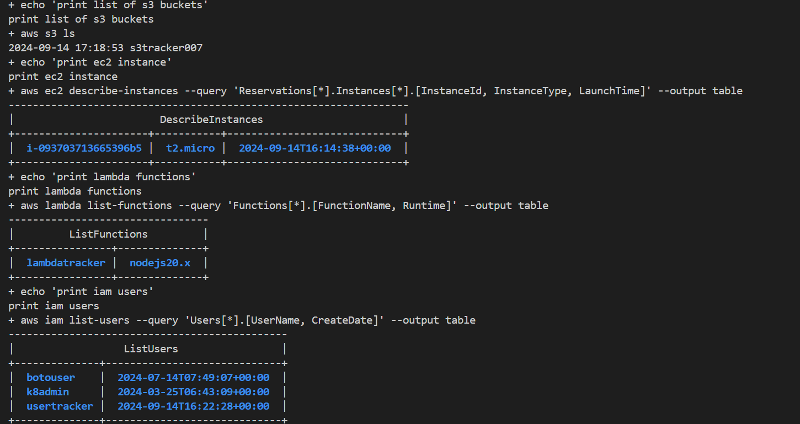

## Creating an aws usage report with bash scripting

## Requirements
AWS Account
AWS Cli

Create a file with your preferred editor. In my case i will use VIM.

``vi resourcetracker.sh``

Configure your Bash script respectively and make it easy to understand.

then we populate our script with the first command, taking it step by step.

Now lets test the script, but first we give our script the necessary permission.

Then we run out script with the following command ``./resourcetracker.sh`` and get the following 

print list of s3 buckets
2024-09-14 17:18:53 s3tracker007
print ec2 instance
{
    "Reservations": [
        {
            "Groups": [],
            "Instances": [
                {
                    "AmiLaunchIndex": 0,
                    "ImageId": "ami-0182f373e66f89c85",
                    "InstanceId": "i-093703713665396b5",
                    "InstanceType": "t2.micro",
                    "KeyName": "tracker_pair",
                    "LaunchTime": "2024-09-14T16:14:38+00:00",
                    "Monitoring": {
                        "State": "disabled"
                    },
                    "Placement": {
                        "AvailabilityZone": "us-east-1f",
                        "GroupName": "",
                        "Tenancy": "default"
:
print lambda functions

usage: aws [options] <command> <subcommand> [<subcommand> ...] [parameters]
To see help text, you can run:

  aws help
  aws <command> help
  aws <command> <subcommand> help

aws: error: argument operation: Invalid choice, valid choices are:

add-layer-version-permission             | add-permission                          
create-alias                             | create-code-signing-config              
create-event-source-mapping              | create-function                         
create-function-url-config               | delete-alias                            
delete-code-signing-config               | delete-event-source-mapping             
delete-function                          | delete-function-code-signing-config     
delete-function-concurrency              | delete-function-event-invoke-config     
delete-function-url-config               | delete-layer-version                    
delete-provisioned-concurrency-config    | get-account-settings                    
get-alias                                | get-code-signing-config                 
get-event-source-mapping                 | get-function                            
get-function-code-signing-config         | get-function-concurrency                
get-function-configuration               | get-function-event-invoke-config        
get-function-recursion-config            | get-function-url-config                 
get-layer-version                        | get-layer-version-by-arn                
get-layer-version-policy                 | get-policy                              
get-provisioned-concurrency-config       | get-runtime-management-config           
invoke                                   | invoke-async                            
list-aliases                             | list-code-signing-configs               
list-event-source-mappings               | list-function-event-invoke-configs      
list-function-url-configs                | list-functions                          
list-functions-by-code-signing-config    | list-layer-versions                     
list-layers                              | list-provisioned-concurrency-configs    
list-tags                                | list-versions-by-function               
publish-layer-version                    | publish-version                         
put-function-code-signing-config         | put-function-concurrency                
put-function-event-invoke-config         | put-function-recursion-config           
put-provisioned-concurrency-config       | put-runtime-management-config           
remove-layer-version-permission          | remove-permission                       
tag-resource                             | untag-resource                          
update-alias                             | update-code-signing-config              
update-event-source-mapping              | update-function-code                    
update-function-configuration            | update-function-event-invoke-config     
update-function-url-config               | wizard                                  
wait                                     | help                                    

Invalid choice: 'list-funtions', maybe you meant:

  * list-functions

print iam users
{
    "Reservations": [
        {
            "Groups": [],
            "Instances": [
                {
                    "AmiLaunchIndex": 0,
                    "ImageId": "ami-0182f373e66f89c85",
                    "InstanceId": "i-093703713665396b5",
                    "InstanceType": "t2.micro",
                    "KeyName": "tracker_pair",
                    "LaunchTime": "2024-09-14T16:14:38+00:00",
                    "Monitoring": {
                        "State": "disabled"
                    },
                    "Placement": {
                        "AvailabilityZone": "us-east-1f",
                        "GroupName": "",
                        "Tenancy": "default" 
                    }
Overwhelming right? we can further streamline the script and narrowdown what exactly we want to see with the following.

And we get the following. Easier to read right?

